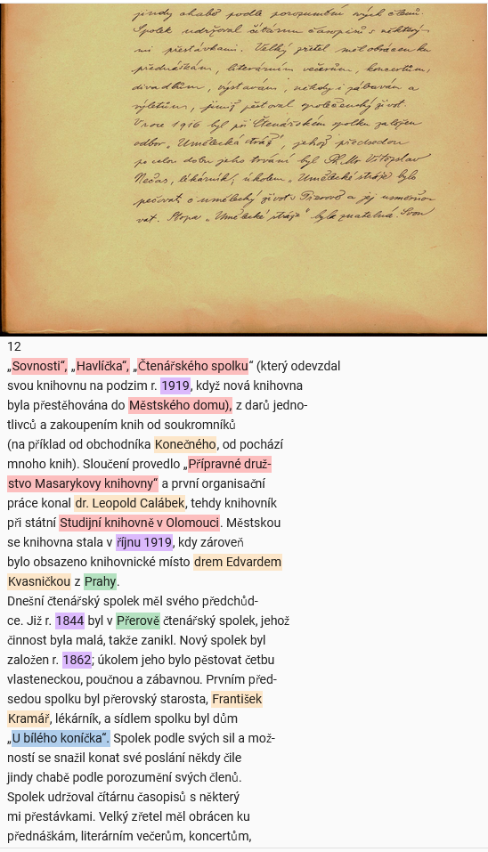

# PERO OCR NER 1.0

Dataset

This is a dataset created for master thesis "Document Information Extraction".  
Author: Roman Janík (xjanik20), 2023  
Faculty of Information Technology, Brno University of Technology

## Description

This is a **P**ERO **O**CR **NER** 1.0 dataset for Named Entity Recognition. The dataset consists of 9,310 Czech sentences with 14,639 named entities.
Source data are Czech historical chronicles mostly from the first half of the 20th century. The chronicles scanned images were processed by PERO OCR [1][1]. 
Text data were then annotated in the Label Studio tool. The process was semi-automated, first a NER model was used to pre-annotate the data and then 
the pre-annotations were manually refined. Named entity types are: *Personal names*, *Institutions*, *Geographical names*, *Time expressions*, and *Artifact names/Objects*; the same as in Czech Historical Named Entity Corpus (CHNEC)[2][2]. 

The CoNLL files are formatted as follows:

Each line in
the corpus contains information about one word/token. The first column is the actual
word, and the second column is a Named Entity class in a BIO format. An empty line is a sentence separator.

For detailed documentation, please see [doc/documentation.pdf]().

## Data

Data are organized as follows: `data/conll` contains dataset CoNLL files, with whole data in `poner.conll` and splits used 
for training in the original thesis. These splits are 0.45/0.50/0.05 for train/test/dev. You can create your own splits with `scripts/split_poner_dataset_conll.py`. `data/hugging_face` contains original splits in the Hugging Face format. `data/label_studio_annotations`
contains the final Label Studio JSON export file. `data/source_data` contains original text and image files of annotated pages.

#### Examples

CoNLL:
```
Od O
9. B-t
listopadu I-t
1895 I-t
zastupoval O
starostu O
Fr B-p
. I-p
Štěpka I-p
zemřel O
2. B-t
února I-t
1896 I-t
) O
pan O
Jindřich B-p
Matzenauer I-p
. O

```

Label Studio page:


## Scripts

Directory `scripts` contain Python scripts used for the creation of the dataset. There are two scripts for
editing Label Studio JSON annotation file, one for creating CoNLL version out of an annotation file and text files,
one for creating splits and one for loading CoNNL files and transforming them to the Hugging Face dataset format. Scripts are written in Python 10.0.
To be able to run all scripts, in the scripts directory run the:

```shellscript
pip install  -r requirements.txt
```

## License

PONER is licensed under the Apache License Version 2.0.

## Citation

If you use PONER in your work, please cite the
[Document Information Extraction](https://dspace.vutbr.cz/handle/11012/213801?locale-attribute=en).

```
@mastersthesis{janik-2023-document-information-extraction,
    title = "Document Information Extraction",
    author = "Janík, Roman",
    language = "eng",
    year = "2023",
    school = "Brno University of Technology, Faculty of Information Technology",
    url = "https://dspace.vutbr.cz/handle/11012/213801?locale-attribute=en",
    type = "Master’s thesis",
    note = "Supervisor Ing. Michal Hradiš, Ph.D."
}
```

## References
[1]: **O Kodym, M Hradiš**: *Page Layout Analysis System for Unconstrained Historic Documents.* ICDAR, 2021, [PERO OCR](https://pero-ocr.fit.vutbr.cz/).

[2]: **Hubková, H., Kral, P. and Pettersson, E.** Czech Historical Named Entity
Corpus v 1.0. In: *Proceedings of the 12th Language Resources and Evaluation Conference.* Marseille, France: European Language Resources Association, May 2020, p. 4458–4465. ISBN 979-10-95546-34-4. Available at:
https://aclanthology.org/2020.lrec-1.549.
